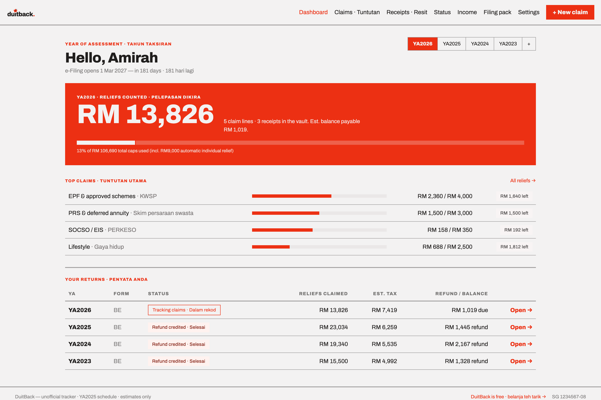
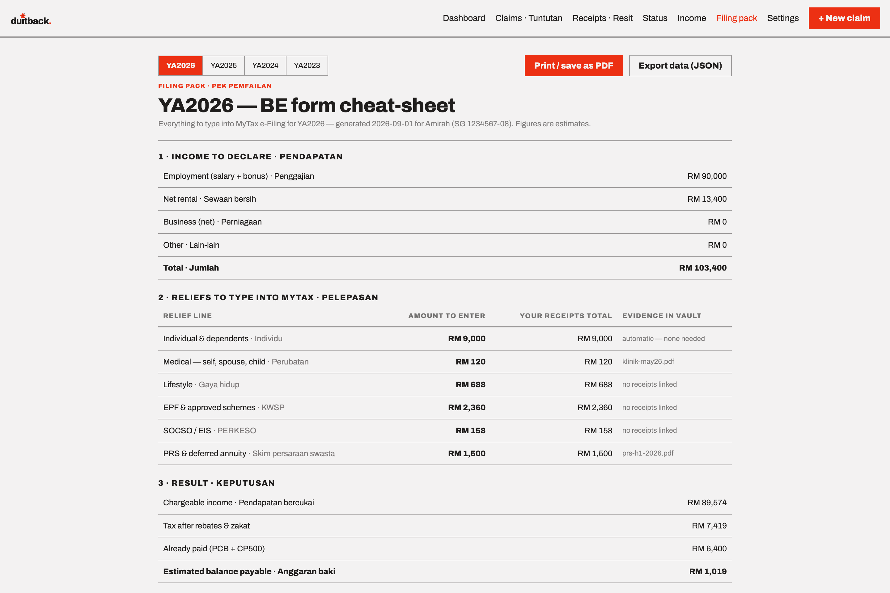
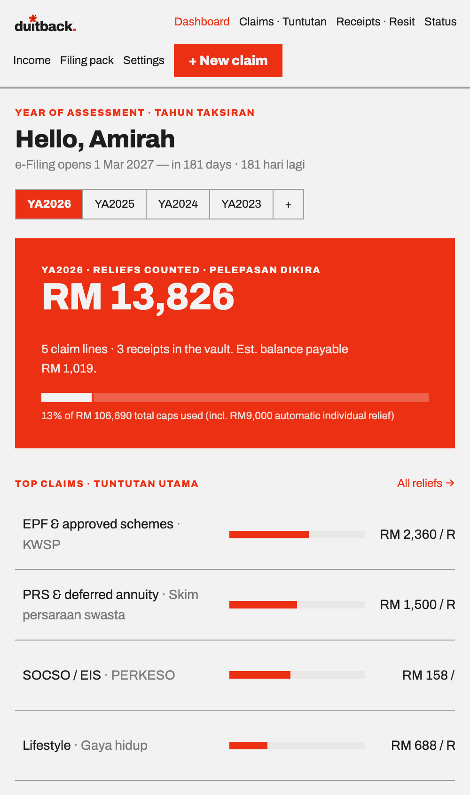
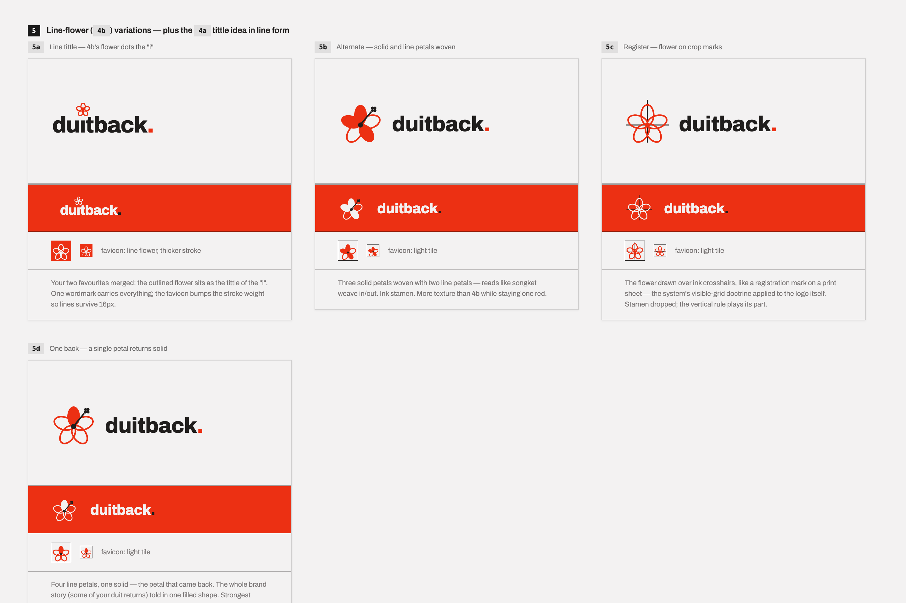

# DuitBack — Malaysian Tax Relief Tracker

*Duit* is Malay for money; DuitBack is about getting yours back. It tracks a Malaysian personal income tax return (Form BE) through the year — relief claims against the real LHDN caps, receipts in one vault, a live refund/balance estimate — then hands you a cheat-sheet with every number to type into MyTax when e-Filing opens. The whole app is one self-contained HTML file, and all data stays in your browser: no backend, no account, no tracking.



Malaysian reliefs are use-it-or-lose-it: whatever cap you haven't spent to by 31 December is gone. But most people only find out what they had left in March, staring at e-Filing over a shoebox of receipts. DuitBack flips the timing — log claims as you spend, see "RM 1,812 left on Lifestyle" in September while you can still do something about it, and file in March from a one-page pack instead of a reconstruction. Tax records are exactly the kind of data that shouldn't sit in someone else's database, so nothing ever leaves the device.

## Features

**Through the year**
- The full LHDN relief schedule per year of assessment (YA2023–YA2026), each year against its own caps — medical sub-limits enforced, child relief as fixed per-child amounts, donations capped at 10% of aggregate income
- Claim lines per relief category: click a row, see the lines behind it, add the next one in place
- Receipt vault — attach receipts and tag them to claim lines, so every number in the filing pack can point at its evidence
- Dashboard with cap utilisation, top claims, estimated refund or balance payable, and the countdown to e-Filing day; per-YA filing status from "tracking claims" to "refund credited"

**At filing time**
- The filing pack: a per-YA cheat-sheet of everything to type into MyTax — income to declare, each relief line with its receipts total, and the computation down to estimated refund or balance payable (real progressive brackets, rebates and zakat, PCB/CP500 already paid)
- Separate vs joint assessment comparison for married filers, from the spouse's income on the Income screen
- Print / save as PDF

**Data & portability**
- Everything persists in `localStorage`; receipts are stored as data URLs inside the same blob — and a failed write warns you instead of silently dropping data
- JSON export and import for backup or moving devices
- First run loads a demo taxpayer ("Amirah") so the app demos itself
- Bilingual throughout — English · Bahasa Melayu

## Screenshots

<table>
  <tr>
    <td valign="top"></td>
    <td valign="top"></td>
  </tr>
</table>

<sub>All screenshots show the built-in demo data — not a real taxpayer.</sub>

## How it's built

This repo is the whole design process, not just the shipped file:

| File | What it is |
| --- | --- |
| `DuitBack.html` | The app — one ~320 KB self-contained file with the runtime, design system, Archivo fonts and every screen inlined. Works offline from `file://`. |
| `DuitBack App.dc.html` | The design canvas the app was built in |
| `Tax Portal Mockups.dc.html` | Where it started — the "CukaiKu" concept: three dashboard directions, then the seven core screens |
| `DuitBack Logos.dc.html` | The logo exploration — seventeen directions (wau kite, ringgit note, "balik" U-turn road sign…) before the bunga raya line-flower won the wordmark |
| `_ds/modernist-…/` | The Modernist design system: Archivo everywhere, one red, zero corner radius, strong 2px rules, everything flush left |
| `support.js` | The canvas runtime — lets the `.dc.html` files above render locally |
| `uploads/` | Reference imagery — the wau bulan from the old RM1 note, the 1 sen bunga raya |



The name went through "CukaiKu" (*my tax*) before landing on DuitBack — the `localStorage` key still says `cukaiku_v3`. The mark is the bunga raya drawn as a line flower dotting the "i", because the brand story is small amounts of duit coming back.

## Accuracy & limits

DuitBack is an unofficial tracker, not tax advice — every screen's footer says so. The YA2023–YA2026 cap schedules, the progressive bracket table, rebates and zakat handling follow the LHDN schedule, but everything it shows is an estimate; MyTax is the authority on filing day.

## Tradeoffs

Choices I'd defend, and where their ceilings are:

- **One self-contained HTML file.** No build, no server, no install — you can send it over WhatsApp and it just opens. The ceiling is app growth; the path is the same rebuild-into-TypeScript-with-tests that [expense-web](https://github.com/MeepingGale/expense-web) went through.
- **`localStorage` + data-URL receipts.** Tax documents never touch a server. Receipt volume is the pressure point; IndexedDB is the upgrade path.
- **Hand-maintained schedule data.** Caps and brackets live as plain data at the top of the file, one override set per YA. Someone has to update them every Budget — that someone is me, once a year.

## Run locally

```bash
open DuitBack.html             # the app — no install, no build, no server
open "DuitBack App.dc.html"    # the design canvases open the same way
```

## Roadmap

- Deploy to GitHub Pages
- YA2027 schedule once the Budget is gazetted

## License

**All rights reserved.** The source is public to read, not to use — no permission is granted to copy, modify, or redistribute it in any form.
